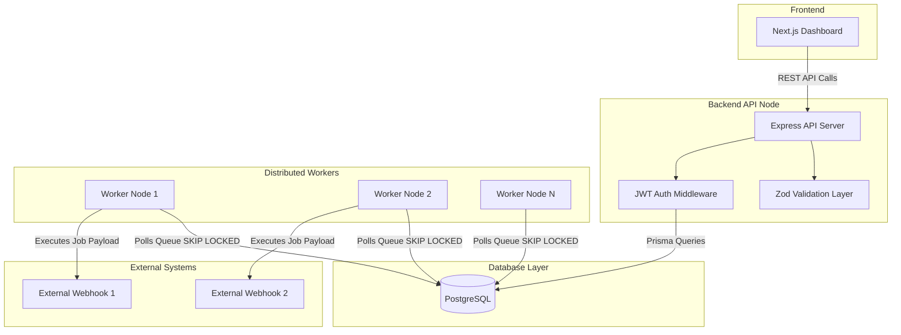

# Architecture Diagram

This diagram illustrates the high-level architecture of the Distributed Job Scheduler.

## Description
- **Frontend**: A React/Next.js dashboard that visualizes queues, jobs, and workers. It polls the REST API for live updates.
- **Backend API Node**: An Express.js application responsible for receiving jobs, pausing queues, and serving metrics. It strictly validates payloads and uses JWT for auth.
- **Database Layer**: PostgreSQL acts as both the primary datastore and the message broker.
- **Distributed Workers**: Horizontally scalable Node.js processes that constantly poll the database. They achieve atomic locks using `SKIP LOCKED` to prevent duplicate processing.
