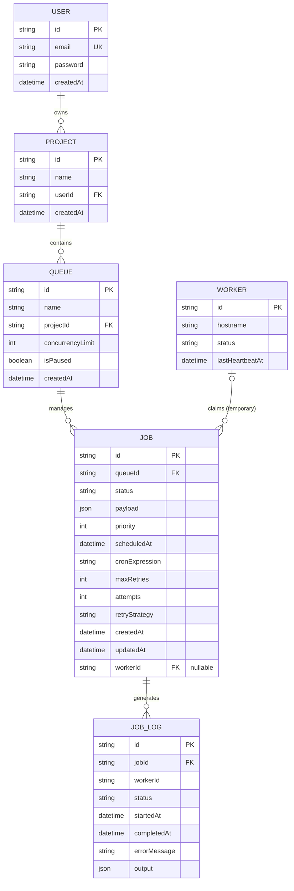

# Entity Relationship (ER) Diagram

This diagram visualizes the relational schema designed in Prisma for the Distributed Job Scheduler.

## Schema Normalization & Design Choices
- **Cascading Deletes**: `ON DELETE CASCADE` is implemented heavily. If a Project is deleted, its Queues, Jobs, and JobLogs are automatically scrubbed to prevent orphaned data.
- **Indexes**: A composite index exists on `Job (queueId, status, scheduledAt, priority Desc)`. This specifically optimizes the `SKIP LOCKED` polling query used by workers, making sure they can fetch top-priority, ready jobs in constant time `O(log N)` without scanning the entire table.
- **JobLog History**: Instead of creating a complex relational table just for retry history, the `JobLog` acts as an append-only ledger for every single execution attempt, making it extremely easy to build a timeline UI for a single job.
